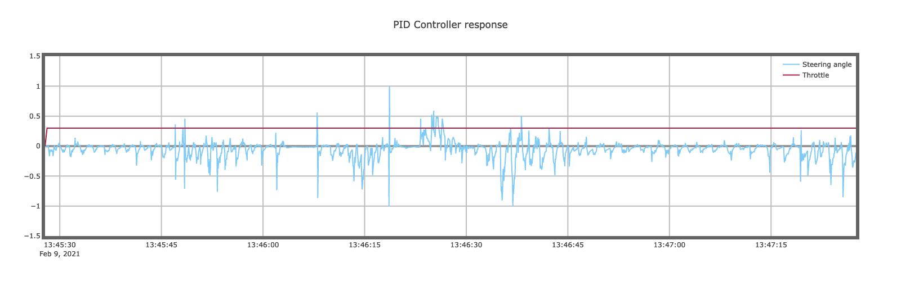

# PID Controller Writeup

> This repository contains the work for the PID Controller project in the Self-Driving Car Engineer Nanodegree Program of Udacity.

## Running

See [README](./README.md) for details on running the project.

## Implementation

The implementation for the PID controller can be found from `./src/PID.cpp` and `./include/PID.h`. It is used in `./app/main.cpp` where it is fed with data from the simulator. The data consists of Cross Track Error (```double cte```) which is the error with respect to the desired line of driving, the current speed of the vehicle (```double speed```), and the current steering angle (```double angle```). The output of the PID controller is a new steering angle (```double steer_value```) that, when the PID control is applied iteratively, will reduce the error such that the error is minimized and the desired line of driving is accomplished. The car/simulator itself decides what is the desired line of driving and we only need to minimize the error and send the new steering angle to the simulator.

The PID controller needs to be initialized with certain gain values for each term. These will be found manually at first to get a feel of the controller performance.

### Proportional term

The proportional term is repsonsible for the majority of the response to control errors. The response intensity can be controlled by a constant Kp. When the gain is chosen too low, the response to errors will be slow, when too high it overcompensates and makes the system unstable.

### Integral term

The integral term is repsonsible for correcting the total system error accumulated over time. The response intensity of this term can also be controlled by a gain constant Ki.
When too high, the response can make the system overshoot it's target. It is usefull to compensate for system bias due to e.g slight errors in system configuration.

### Derivative term

The derivative term compensates based on what has been previously been done to respond to an error. It helps in gradually decreasing the repsonse so that the desired system state can be aquired in a smoother fashion. Its effects can also be tuned with a gain Kd.

## Hyperparameters

The gains were set manually by experimenting and then inspecting the response on the simulator and the additional graph which plots the steering angle over time.

| Fig 1. PID response graph of one round around the simulation track |
| -------------------------------------------------------------------|
|  |

The general aproach was to first find a Kp which make the response oscillate with both Ki and Kd set to 0.0.

Then the value of Ki was chosen so that the ride was somewhat smoother due to the P component being flattend somewhat due to taking into acount accumulated error.

Then final value Kd was chosen so that the car could react quicker in the case of bigger errors introduced by cornering.

## Explanatory video

The below video shows the response of the car when using a PID controller for steering only.

| Video 1. PID controlled car driving one round around the simulation track |
|---------------------------------------------------------------------------|
|  |

The Twiddle based optimizer (`./src/Optimizer.cpp`) is not enabled as it is still a work in progress.

## Checklist

- [x] Code must compile without errors with cmake and make.
- [x] The PID procedure follows what was taught in the lessons.
- [x] Describe the effect each of the P, I, D components had in your implementation.
- [x] Describe how the final hyperparameters were chosen.
- [x] The vehicle must successfully drive a lap around the track.

## Resources

- [PID controller on Wikipedia](https://en.wikipedia.org/wiki/PID_controller)
